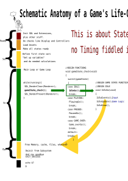

Simple High-Level State patterns in C.

The Bash Script make_states
creates a compiling statepattern.

`./make_states > foo.c`

`$ make foo`

compiles it.

An example with Makefile is enclosed.

Press left MouseButton to goto next State.
The Window Title reflects the State.
In Playing State right MouseButton triggers Game Over!

See: [This Post](https://discourse.libsdl.org/t/need-help-with-menus-in-my-game/24238/7?u=acry)

Get in touch on [SDL-Discourse](https://discourse.libsdl.org).

For more Informations on Gamestates see Videos:

A warning about OOP:

[Object-Oriented Programming is Bad](https://www.youtube.com/watch?v=QM1iUe6IofM)

But if you insist:

[Implementing a Main-Game-Loop](https://www.youtube.com/watch?v=44tO977slsU) in C++.

[Game States and Game Loops](https://www.youtube.com/watch?v=E0Al0-sOO_c) in Python.

